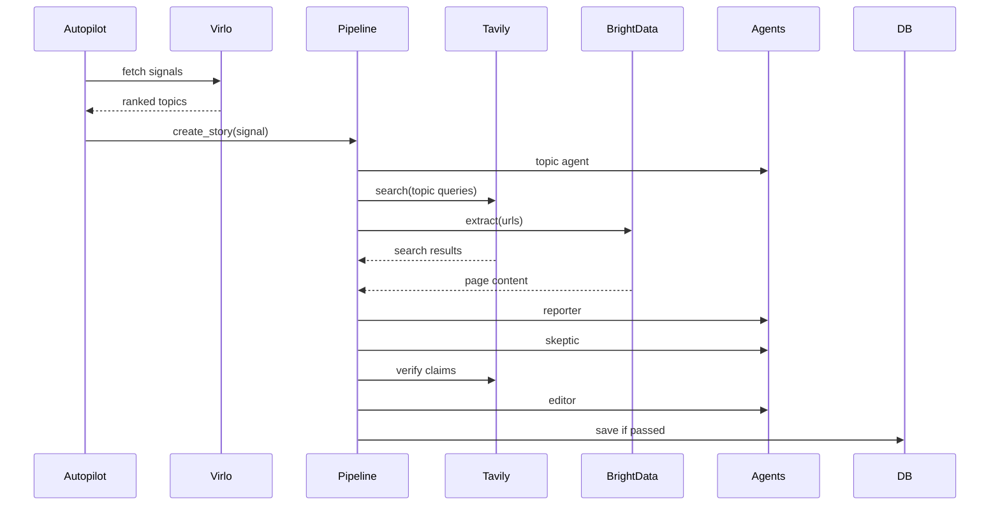

# Skeptik

Skeptik is a zero-editorial AI newsroom built to satisfy the Vibeathon brief: a credible news product where the main event is real reporting, generated and published through an autonomous pipeline with no human in the editorial path.

It combines:

- Agno for multi-agent orchestration
- Featherless.ai for LLM inference
- Tavily for discovery and search-backed verification
- Bright Data for page extraction
- Virlo for trend selection, urgency, and ranking
- FastAPI for the newsroom API
- Next.js, Tailwind, and shadcn-style primitives for the frontend
- SQLite today, with a clean path to Postgres

## Why This Exists

Most AI news products are dressed-up summarizers. Skeptik is intentionally different:

- Topics are selected from live Virlo-style signals, not editorial whim
- Stories are synthesized across multiple sources, not paraphrased from one article
- Drafts are challenged by a skeptic agent before publication
- Claims are routed through a fact-check stage
- Publication is controlled by deterministic policy gates
- Readers can inspect how the story was made
- Provider health is visible when live integrations fail

That makes this feel closer to an autonomous desk than a chatbot with headlines.

## Stack

### Backend

- Python 3.11+
- FastAPI
- Agno
- Featherless.ai OpenAI-compatible API
- Tavily API
- Bright Data API
- Virlo API
- SQLAlchemy
- SQLite

### Frontend

- Next.js 15 App Router
- React 19
- Tailwind CSS
- shadcn-style UI primitives
- `marked` for article rendering
- `lucide-react` for iconography

## API And Model Configuration

The backend is configured around Featherless’ OpenAI-compatible interface and now defaults to:

```env
FEATHERLESS_BASE_URL=https://api.featherless.ai/v1
FEATHERLESS_MODEL=moonshotai/Kimi-K2.5
```

Relevant configuration lives in [backend/app/config.py](/Users/shk/experiments/skeptik/backend/app/config.py) and [backend/app/services/agents.py](/Users/shk/experiments/skeptik/backend/app/services/agents.py).

## Live API Mode

Skeptik now runs in strict live-integration mode.

- No fake Virlo trends
- No seeded Tavily source packs
- No fallback article bodies
- No hidden provider substitution in the frontend

If a provider fails, the backend reports it in `/api/status` and the frontend renders that integration error directly.

## Repository Layout

```text
skeptik/
├── backend/
│   ├── app/
│   │   ├── main.py
│   │   ├── config.py
│   │   ├── models.py
│   │   ├── schemas.py
│   │   └── services/
│   │       ├── agents.py
│   │       ├── autopilot.py
│   │       ├── brightdata.py
│   │       ├── ingestion.py
│   │       ├── newsroom.py
│   │       ├── storage.py
│   │       ├── tavily.py
│   │       └── virlo.py
│   ├── Dockerfile
│   └── pyproject.toml
├── frontend/
│   ├── app/
│   ├── components/
│   ├── lib/
│   └── Dockerfile
├── docs/
│   ├── TECHNICAL_BLOG.md
│   ├── X_THREAD.md
│   └── LINKEDIN_POST.md
├── docker-compose.yml
└── README.md
```

## Product Overview

### Reader Experience

Skeptik presents:

- A front page with a lead story and ranked desk
- Integration health cards for Virlo, Tavily, Bright Data, Featherless, and backend state
- An article page with:
  - final published story
  - “Why you’re seeing this”
  - confidence and disagreement scores
  - source transparency
  - reporter, skeptic, and fact-check traces

### Editorial Experience

There is no human editorial queue. The system loops autonomously:

1. Pull Virlo signals
2. Generate a topic pitch
3. Build a knowledge pack from Tavily + Bright Data
4. Write the story
5. Challenge the draft
6. Verify claims
7. Publish or reject via deterministic logic

## Architecture

### System Diagram


### Backend Runtime Diagram



## Core Data Model

The public article shape looks like this:

```json
{
  "title": "How chip export controls are forcing cloud AI providers to rethink supply chains",
  "content": "## ...",
  "summary": "A newsroom-style synthesis...",
  "sources": [],
  "virlo_score": 0.92,
  "confidence_score": 0.83,
  "disagreement_score": 0.29,
  "agent_traces": {
    "reporter": {},
    "skeptic": {},
    "fact_checker": []
  }
}
```

Schemas live in [backend/app/schemas.py](/Users/shk/experiments/skeptik/backend/app/schemas.py).

## How The Pipeline Works

### 1. Topic Selection

Virlo signals are converted into a structured pitch:

```python
TopicPitch(
    topic=signal.topic,
    angle=signal.angle,
    urgency=signal.urgency,
    virlo_score=signal.signal_strength,
    why_now=signal.explanation,
    search_queries=[...],
)
```

### 2. Ingestion

The ingestion layer discovers URLs with Tavily and enriches them with Bright Data:

```python
for query in topic.search_queries:
    all_sources.extend(await self.tavily.search(query))

for source in sources:
    content = await self.brightdata.extract(str(source.url))
```

### 3. Reporting

The reporter receives the topic pitch plus the full knowledge pack:

```python
response = self.agents.reporter_agent().run("\n\n".join(prompt_parts))
```

### 4. Skeptical Review

The skeptic agent scores the draft and identifies missing context, bias, and logic flaws.

### 5. Fact-checking

Claims are verified against live search results, and provider failures are surfaced as explicit errors rather than being masked by fallback content.

### 6. Deterministic Publish Gate

Stories are rejected when:

- false claims exceed threshold
- uncertainty is too high
- skeptic pressure remains too high after revision
- sources are insufficient

That logic lives in [backend/app/services/newsroom.py](/Users/shk/experiments/skeptik/backend/app/services/newsroom.py).

## Integration Diagnostics

The backend exposes integration state in `/api/status`:

```json
{
  "integrations": {
    "virlo": {
      "status": "ok",
      "details": "14 trends loaded"
    },
    "brightdata": {
      "status": "error",
      "last_error": "Bright Data request failed with 400"
    }
  }
}
```

This status is rendered on the homepage so judges can immediately tell whether the newsroom is operating on live APIs or blocked by a provider.

## Key Files

- API entrypoint: [backend/app/main.py](/Users/shk/experiments/skeptik/backend/app/main.py)
- Agent configuration: [backend/app/services/agents.py](/Users/shk/experiments/skeptik/backend/app/services/agents.py)
- Pipeline controller: [backend/app/services/newsroom.py](/Users/shk/experiments/skeptik/backend/app/services/newsroom.py)
- Autopilot loop: [backend/app/services/autopilot.py](/Users/shk/experiments/skeptik/backend/app/services/autopilot.py)
- Front page UI: [frontend/app/page.tsx](/Users/shk/experiments/skeptik/frontend/app/page.tsx)
- Article page UI: [frontend/app/articles/[slug]/page.tsx](/Users/shk/experiments/skeptik/frontend/app/articles/[slug]/page.tsx)

## Local Development

### 1. Backend

```bash
cd /Users/shk/experiments/skeptik/backend
cp .env.example .env
python3 -m venv .venv
source .venv/bin/activate
pip install -e .
uvicorn app.main:app --reload --port 8000
```

### 2. Frontend

```bash
cd /Users/shk/experiments/skeptik/frontend
cp .env.local.example .env.local
npm install
npm run dev
```

Open [http://localhost:3000](http://localhost:3000).

### 3. Production Build Checks

```bash
cd /Users/shk/experiments/skeptik/frontend
npm run build
```

```bash
cd /Users/shk/experiments/skeptik/backend
FEATHERLESS_API_KEY='' TAVILY_API_KEY='' BRIGHTDATA_API_KEY='' VIRLO_API_KEY='' ./.venv/bin/python -c "from fastapi.testclient import TestClient; from app.main import app; tc=TestClient(app); tc.__enter__(); print(tc.get('/api/status').json()); tc.__exit__(None, None, None)"
```

## Environment Variables

### Backend

```env
APP_ENV=development
APP_NAME=Skeptik Newsroom API
APP_URL=http://localhost:8000
FRONTEND_URL=http://localhost:3000
DATABASE_URL=sqlite:///./skeptik.db

FEATHERLESS_API_KEY=
FEATHERLESS_BASE_URL=https://api.featherless.ai/v1
FEATHERLESS_MODEL=moonshotai/Kimi-K2.5

TAVILY_API_KEY=
TAVILY_API_URL=https://api.tavily.com

BRIGHTDATA_API_KEY=
BRIGHTDATA_API_URL=https://api.brightdata.com/request

VIRLO_API_KEY=
VIRLO_API_URL=https://api.virlo.ai/v1/trends/digest
```

### Frontend

```env
NEXT_PUBLIC_API_URL=http://localhost:8000
```

## Easiest Deployment

The easiest submission path is:

- Frontend on Vercel
- Backend on Render

That gets you:

- live HTTPS quickly
- minimal ops
- simple env var management
- no extra cloud setup

### Backend on Render

This repo includes a Render blueprint at [render.yaml](/Users/shk/experiments/skeptik/render.yaml).

#### Steps

1. Push this repo to GitHub
2. In Render, create a new Blueprint or Web Service from the repo
3. Use the backend service defined in `render.yaml`
4. Fill in these env vars in Render:
   - `APP_URL`
   - `FRONTEND_URL`
   - `FEATHERLESS_API_KEY`
   - `TAVILY_API_KEY`
   - `BRIGHTDATA_API_KEY`
   - `BRIGHTDATA_ZONE`
   - `VIRLO_API_KEY`
5. Deploy

The backend health endpoint is:

```text
/health
```

The pipeline trigger endpoint is:

```text
/api/pipeline/run
```

Important:

- This simplified deploy uses `sqlite:////tmp/skeptik.db`
- It is good for a live demo and submission
- It is not durable production storage

After deploy, generate a few stories manually:

```bash
curl -X POST https://your-render-backend.onrender.com/api/pipeline/run
curl -X POST https://your-render-backend.onrender.com/api/pipeline/run
curl -X POST https://your-render-backend.onrender.com/api/pipeline/run
```

### Frontend on Vercel

1. Import the same repo into Vercel
2. Set the project root directory to `frontend`
3. Add:

```env
NEXT_PUBLIC_API_URL=https://your-render-backend.onrender.com
```

4. Deploy

### Final Submission Flow

1. Deploy backend to Render
2. Deploy frontend to Vercel
3. Trigger `/api/pipeline/run` a few times so the homepage has real stories
4. Open the Vercel URL and confirm:
   - homepage loads over HTTPS
   - article pages load
   - integration health cards are visible
   - Virlo/Tavily/Featherless status is visible
5. Paste the Vercel frontend URL into the Vibeathon submission form

### What URL To Submit

Submit the frontend URL, not the backend API URL.

Example:

- Good: `https://skeptik.vercel.app`
- Bad: `https://skeptik-backend.onrender.com/api/status`

### Suggested Judge Note

```text
Zero-editorial AI newsroom. Virlo drives topic selection and ranking, Tavily powers discovery and verification, Bright Data handles extraction, and Featherless powers the multi-agent editorial pipeline via Agno. The app shows confidence, disagreement, sources, and live integration health directly in the interface.
```

## Forking And Contributing

### Recommended Flow

1. Fork the repository
2. Create a feature branch
3. Add or update tests where practical
4. Run the frontend build and backend smoke checks
5. Open a PR with:
   - problem statement
   - screenshots for UI changes
   - real API output for backend changes

### Areas Where Contributions Would Help

- Postgres migration and Alembic migrations
- Real article image handling and media pipeline
- Better source de-duplication and domain scoring
- Human-readable claim evidence rendering
- More granular article status timeline
- Playwright smoke tests for demo paths
- Sentry / OpenTelemetry instrumentation
- Virlo adaptive ranking explanations
- Webhook-triggered publish runs
- Slack or Discord alerting for rejected stories

### New Features Worth Adding

- Sector-specific desks such as energy, health, AI policy, or markets
- Reader-side “trust lens” for source quality breakdowns
- Story diff view showing draft-to-edited changes
- Contrarian mode where a second skeptic agent argues the opposite case
- Regional ranking layers on top of Virlo
- Analyst brief mode for executive audiences

## Design Notes

The UI intentionally avoids generic AI-dashboard aesthetics. The front page leans into:

- strong serif typography
- restrained metric surfaces
- a publication-style lead story
- explicit Virlo positioning
- transparency without exposing raw prompt noise

## Known Tradeoffs

- SQLite is convenient for demoability but should move to Postgres in production
- Bright Data extraction depends on the active zone type configured in your account and may need endpoint-specific request tuning
- Real source freshness and dedupe scoring can be improved
- The app now prefers explicit provider errors over silent fallbacks

## Additional Docs

- Technical blog: [docs/TECHNICAL_BLOG.md](/Users/shk/experiments/skeptik/docs/TECHNICAL_BLOG.md)
- X thread: [docs/X_THREAD.md](/Users/shk/experiments/skeptik/docs/X_THREAD.md)
- LinkedIn post: [docs/LINKEDIN_POST.md](/Users/shk/experiments/skeptik/docs/LINKEDIN_POST.md)

## Credits

Built by [Harish Kotra](https://harishkotra.me). More builds at [dailybuild.xyz](https://dailybuild.xyz).
