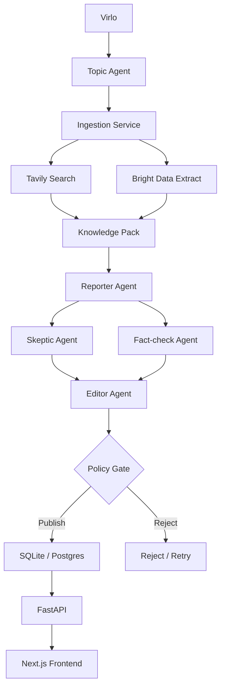

# Building Skeptik: A Zero-Editorial Autonomous Newsroom With Agno, Featherless, Tavily, Bright Data, and Virlo

## Intro

Skeptik started from a simple product constraint: do not build another AI news summarizer.

The brief demanded something harder and more interesting:

- serious articles
- a fully autonomous editorial path
- clear transparency into how each story was generated
- strong use of Virlo for story ranking and urgency

So the product had to behave less like “chat over links” and more like a newsroom system with policy, skepticism, and publication gates.

This post walks through the architecture, key code paths, design choices, and the failure modes we had to account for without hiding them behind fake content.

## The Product Goal

The target experience was:

1. Readers land on a newsroom front page
2. They see a lead story that feels publishable
3. They understand why this story is rising now
4. They can inspect the agentic reporting chain
5. They can trust that stories were challenged before publication

That shaped both the backend and the frontend.

## Architecture



## Why These Technologies

### Agno

Agno provides a clean mental model for defining agents with clear responsibilities. The newsroom needed explicit stage ownership:

- topic framing
- reporting
- skepticism
- fact-checking
- editing

That maps naturally to an agent-oriented architecture.

### Featherless.ai

Featherless gives an OpenAI-compatible interface over open models. That let us use a single integration surface while swapping model IDs. We moved the backend to `moonshotai/Kimi-K2.5` to avoid poor generation behavior from the previous model.

### Tavily

Tavily is a good fit for news discovery because the workflow is query-heavy and verification-heavy. We use it for:

- story discovery
- source retrieval
- claim verification

### Bright Data

Search snippets are not enough for reporting. Bright Data is the extraction layer, but one practical lesson here is that Bright Data zone type matters. Browser API zones and Unlocker-style request zones do not behave the same way through the same request surface.

That is exactly why the app now surfaces provider failures directly instead of pretending extraction succeeded.

### Virlo

Virlo is the ranking brain. It is not a UI ornament. It drives:

- story selection
- urgency
- signal strength
- “why you’re seeing this”

## Backend Structure

The backend entrypoint is [backend/app/main.py](/Users/shk/experiments/skeptik/backend/app/main.py). The important design choice is that startup seeds the newsroom and begins an autonomous loop.

```python
@asynccontextmanager
async def lifespan(_: FastAPI):
    Base.metadata.create_all(bind=engine)
    await autopilot.seed_if_needed()
    autopilot.start()
    try:
        yield
    finally:
        await autopilot.stop()
```

This makes the product feel alive immediately.

## The Ingestion Layer

The ingestion service combines Tavily and Bright Data into a knowledge pack:

```python
for query in topic.search_queries:
    all_sources.extend(await self.tavily.search(query))

for source in sources:
    content = await self.brightdata.extract(str(source.url))
```

That knowledge pack becomes the foundation for all downstream editorial work.

The key point is that the reporting stage does not read one article. It reads a source bundle.

## The Multi-Agent Newsroom

### Topic Agent

Converts Virlo signals into a structured reporting pitch.

### Reporter Agent

Produces the first long-form draft with explicit claims and multiple perspectives.

### Skeptic Agent

Challenges the draft for:

- bias
- missing context
- weak reasoning
- overclaiming

### Fact-check Agent

Validates extracted claims against source retrieval.

### Editor Agent

Produces the final article if the draft survives policy.

## Policy Matters More Than Prompting

One of the most important parts of this system is not the prose generation. It is the deterministic controller in [backend/app/services/newsroom.py](/Users/shk/experiments/skeptik/backend/app/services/newsroom.py).

```python
if false_claims > self.settings.newsroom_max_false_claims:
    return PipelineDecision(status="rejected", reason="false_claims_detected")

if skeptic.skepticism_score > self.settings.newsroom_max_skeptic_score:
    revised = await self._report(topic, knowledge_pack, skeptic=skeptic, prior_draft=reporter)
```

That gives the system editorial discipline.

Without this layer, “multi-agent newsroom” is just prompt theater.

## Designing For Failure

The ugly part of real AI systems is provider instability.

We hit two real issues while building:

1. Agno API drift around structured outputs
2. Featherless upstream failures returning `503 failed_generation`

The first version of the app was demo-safe. That meant a provider failure could quietly fall back to synthetic or seeded content.

That was useful for iteration, but it was the wrong product behavior for a credible newsroom.

The current system runs in strict live-API mode:

- Virlo must return real ranked trend data
- Tavily must return real search results
- Bright Data must return real extraction output
- Featherless must return real structured agent output

```python
raise ProviderAPIError(
    "virlo",
    f"Virlo request failed with {exc.response.status_code}",
    exc.response.status_code,
    body,
)
```

Instead of silently substituting content, Skeptik now reports integration status through `/api/status` and renders those errors on the homepage.

## The Frontend

The frontend is intentionally not a dashboard.

The homepage does three things:

- establishes the publication identity
- foregrounds the lead story
- makes the autonomous process legible

The article page then handles transparency:

- story body
- why-you’re-seeing-this
- fact checks
- source list
- editorial traces

That split is deliberate. The homepage sells the product. The article page proves it.

## Example Frontend Pattern

The homepage lead story is treated like a publication feature block, not a SaaS card:

```tsx
{lead ? (
  <Card className="overflow-hidden bg-ink text-paper">
    <CardContent className="space-y-7 p-8 md:p-10">
      <Badge className="border-white/15 bg-white/10 text-paper">Lead Story</Badge>
      <h2 className="max-w-3xl font-display text-4xl leading-tight md:text-6xl">
        {lead.title}
      </h2>
    </CardContent>
  </Card>
) : null}
```

That small layout choice dramatically improves perceived credibility.

## What I Would Improve Next

If I had another sprint, I would add:

- Postgres + migrations
- stronger source freshness scoring
- more explicit evidence snippets on claim checks
- Playwright smoke tests
- structured observability for publish/reject runs
- provider-specific health diagnostics
- background worker separation from API process

## Advice For Developers Building Similar Systems

### 1. Separate product logic from prompt logic

A newsroom should not depend on “the model behaving.” Put discipline into code.

### 2. Design for provider instability on day one

Do not assume every model call works. They won’t.

### 3. Make transparency legible, not noisy

Readers do not need every raw prompt. They need evidence that the process exists and mattered.

### 4. Give ranking a first-class role

Virlo mattered because it shaped the editorial surface itself, not just a tiny badge.

## Closing

Skeptik is an attempt to take AI-native publishing seriously. The interesting question is not whether an LLM can write an article. It can.

The real question is whether you can build a system around that model that behaves like a newsroom instead of a demo, and whether it tells the truth when its dependencies are broken.

That means:

- ranking
- synthesis
- skepticism
- verification
- policy
- transparency

That is where the product lives.
